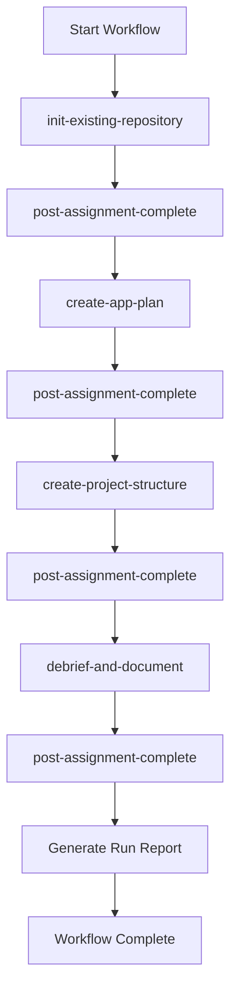

# Project Setup Workflow Orchestration Plan

## Resolution Trace

**Workflow Definition:**

- Raw URL: `https://raw.githubusercontent.com/nam20485/agent-instructions/optimization/ai_instruction_modules/ai-workflow-assignments/dynamic-workflows/project-setup.md`

**Assignment Files (in execution order):**

1. `init-existing-repository` - `https://raw.githubusercontent.com/nam20485/agent-instructions/optimization/ai_instruction_modules/ai-workflow-assignments/init-existing-repository.md`
2. `create-app-plan` - `https://raw.githubusercontent.com/nam20485/agent-instructions/optimization/ai_instruction_modules/ai-workflow-assignments/create-app-plan.md`
3. `create-project-structure` - `https://raw.githubusercontent.com/nam20485/agent-instructions/optimization/ai_instruction_modules/ai-workflow-assignments/create-project-structure.md`
4. `debrief-and-document` - `https://raw.githubusercontent.com/nam20485/agent-instructions/optimization/ai_instruction_modules/ai-workflow-assignments/debrief-and-document.md`

**Post-Assignment Event:**

- `create-repository-summary` (triggered after each assignment completes)

---

## Assignment 1: init-existing-repository

**Purpose:** Initialize repository infrastructure for the PCB Renderer CLI project.

**Steps:**

1. Create GitHub Project (Board template) and link to repository
2. Create project columns: Not Started, In Progress, In Review, Done
3. Import labels using `scripts/import-labels.ps1` with `.github/.labels.json`
4. Rename devcontainer name in `.devcontainer/devcontainer.json` (currently: `pcb-renderer-cli-devcontainer`)
5. Verify `.code-workspace` file naming (currently: `pcb-renderer-cli.code-workspace`)
6. Create branch `project-setup` and PR linked to Project

**Acceptance Criteria:**

- GitHub Project created and linked
- Labels imported successfully
- PR created on new branch

---

## Assignment 2: create-app-plan

**Purpose:** Create comprehensive application development plan based on [Application Implementation Specification.md](plan_docs/Application Implementation Specification.md).

**Steps:**

1. Analyze the specification document and linked docs in `plan_docs/`
2. Document tech stack (Python 3.11+, Pydantic, NumPy, Matplotlib, pytest, hypothesis, syrupy)
3. Create GitHub Issue using `.github/ISSUE_TEMPLATE/application-plan.md` template
4. Create milestones for each phase:
  - Phase 1: Foundation (Pydantic models, parsing, unit normalization)
  - Phase 2: Transforms (NumPy geometric pipeline)
  - Phase 3: Rendering (Matplotlib engine, SVG/PNG/PDF)
  - Phase 4: Validation & Testing (14 error classes, property-based tests)
  - Phase 5: CLI & Polish (argparse CLI, packaging with uv)
5. Create Epic sub-issues for each phase using `.github/ISSUE_TEMPLATE/epic.md`

**Key Files:**

- Input: `plan_docs/Application Implementation Specification.md`
- Template: `.github/ISSUE_TEMPLATE/application-plan.md`
- Epic Template: `.github/ISSUE_TEMPLATE/epic.md`

**Acceptance Criteria:**

- GitHub Issue created (not local markdown)
- Milestones created and linked
- Epic sub-issues created for each phase
- No implementation code written

---

## Assignment 3: create-project-structure

**Purpose:** Create Python project scaffolding for PCB Renderer CLI.

**Steps:**

1. Create solution structure per specification:

```
pcb-renderer/
├── pyproject.toml
├── uv.lock
├── src/
│   └── pcb_render/
│       ├── __init__.py
│       ├── cli.py
│       ├── models.py
│       ├── geometry.py
│       ├── render.py
│       └── validate.py
├── tests/
│   ├── fixtures/
│   ├── invalid_boards/
│   └── snapshots/
└── README.md
```

1. Create `pyproject.toml` with dependencies:
  - pydantic ~= 2.0
  - numpy ~= 1.26
  - matplotlib ~= 3.8
  - pytest, hypothesis, syrupy (dev)
  - ruff (dev)
2. Create/update Docker configuration in `docker/`
3. Create GitHub Actions workflow `ci.yml` for build/lint/test
4. Create `.ai-repository-summary.md`
5. Verify solution builds with `uv sync`

**Acceptance Criteria:**

- Project structure matches specification
- `pyproject.toml` valid and complete
- Docker configuration functional
- CI workflow created
- Repository summary generated

---

## Assignment 4: debrief-and-document

**Purpose:** Capture learnings and create comprehensive debrief report.

**Steps:**

1. Create debrief report with 12 sections:
  - Executive Summary
  - Workflow Overview
  - Deliverables
  - Lessons Learned
  - What Worked Well
  - Areas for Improvement
  - Errors Encountered
  - Challenges Faced
  - Suggested Changes
  - Metrics
  - Future Recommendations
  - Appendix
2. Post report for stakeholder review
3. Commit report to repository

**Acceptance Criteria:**

- All 12 sections completed
- Report reviewed and approved
- Report committed to repository

---

## Event Handler: post-assignment-complete

After each assignment completes, execute `create-repository-summary` to update `.ai-repository-summary.md` with current state.

---

## Workflow Execution Flow




---

## Prerequisites Verification

- GitHub CLI (`gh`) installed and authenticated
- PowerShell available for scripts
- Repository: `nam20485/board-image-exporter-juliet40-b`
- Branch: `project-setup` (on `optimization` instructions branch)

---

## Run Report Structure

The final Run Report will include:

- Resolution trace (all URLs verified)
- Per-assignment status (PASS/FAIL)
- Event execution log
- Evidence for each acceptance criterion
- Total execution summary

